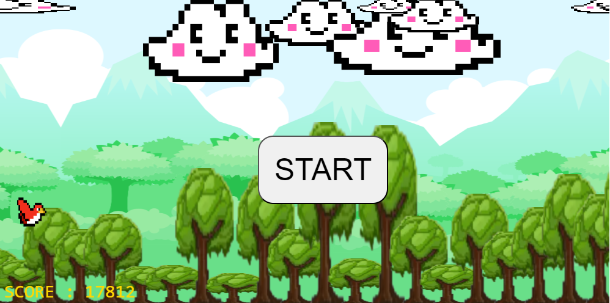

# Flying Bird

### https://wonusuh.github.io/FlyingBird/

### 개발동기 - HTML, CSS, JavaScript 로 구현 된 게임을 제작하고자 함.

### 구현된 기능
1. 캐릭터는 SpaceBar 키로 ***비행(상승)*** 할 수 있다.
2. 장애물(나무와 구름)이 오른쪽에서 왼쪽으로 이동하므로 마치 캐릭터가 왼쪽에서 오른쪽으로 이동하는것처럼 보인다.
3. 나무와 구름의 크기와 위치가 ***무작위로 생성*** 된다.
4. 생존한 시간에따라 ***score*** 가 증가한다.
5. 캐릭터가 장애물과 충돌하면 게임이 종료된다.
6. 플레이어의 ***score가 로컬스토리지에 기록*** 된다.

References : 
Francely Nataly. Flying Bird. [pixel-art]. Web site Dribbble. https://dribbble.com/shots/16193188-Flying-Bird-Pixel-Art